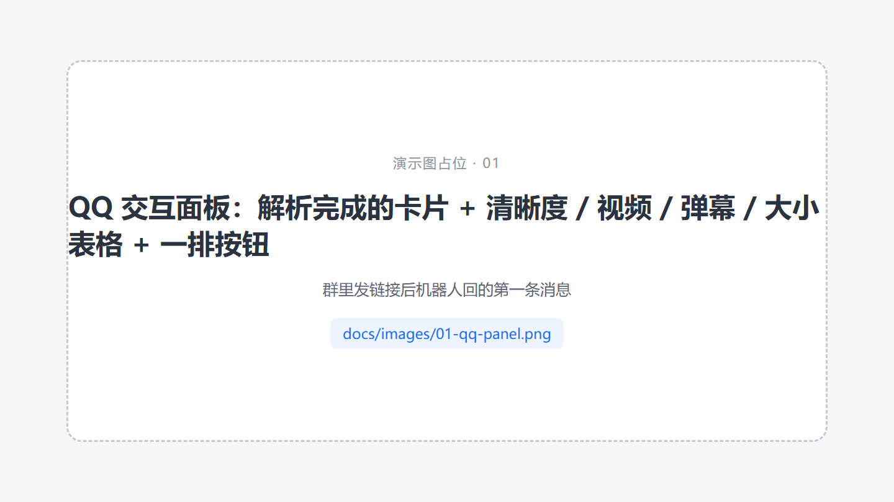
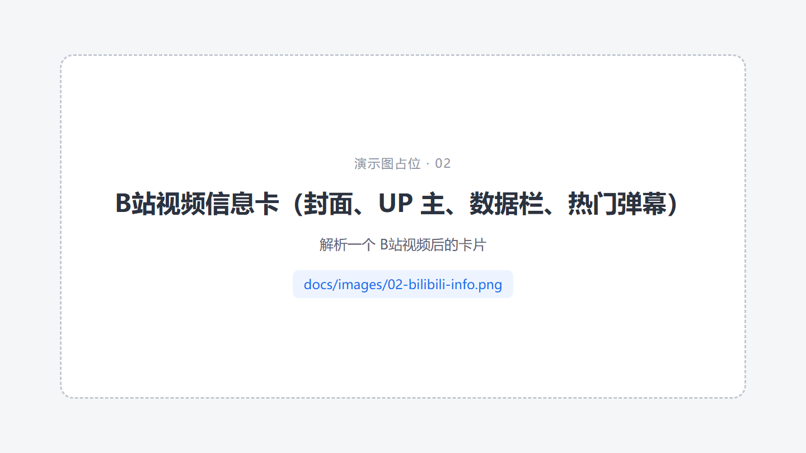
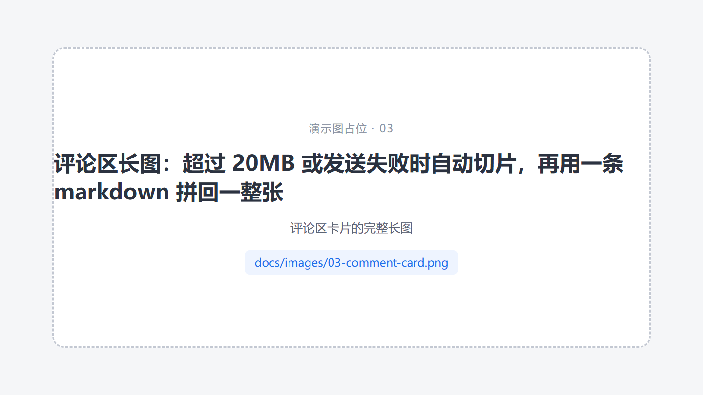
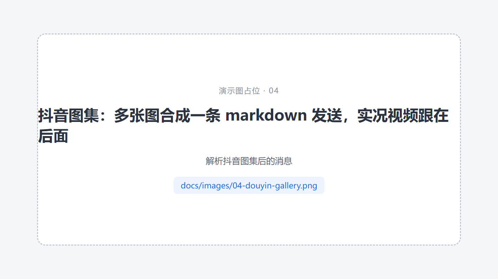
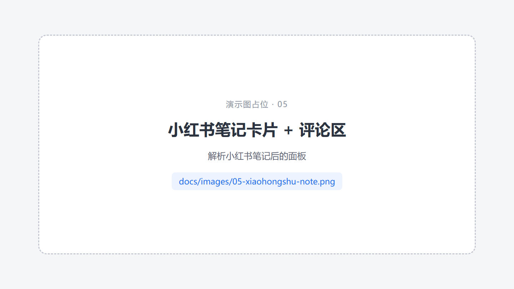
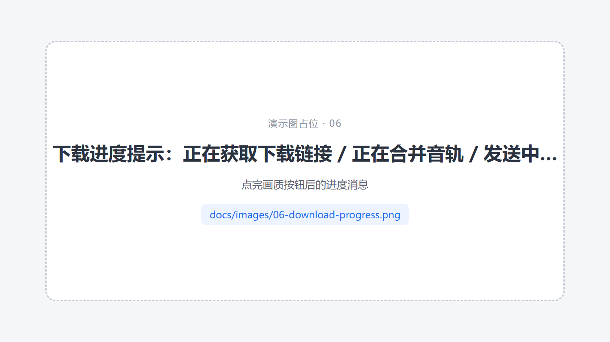
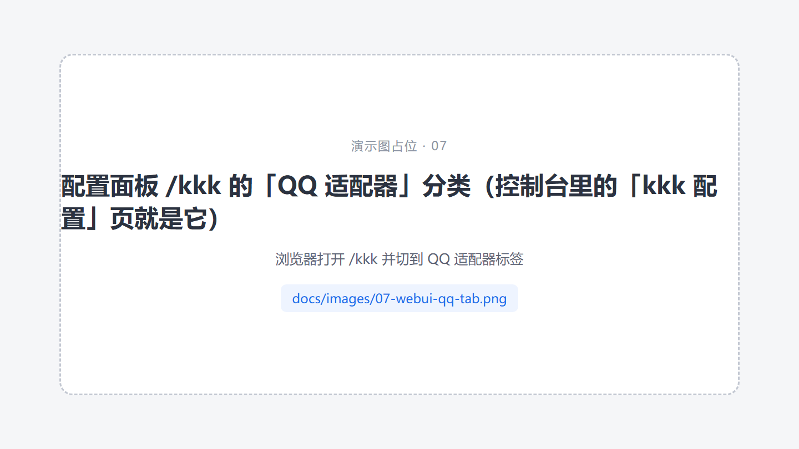
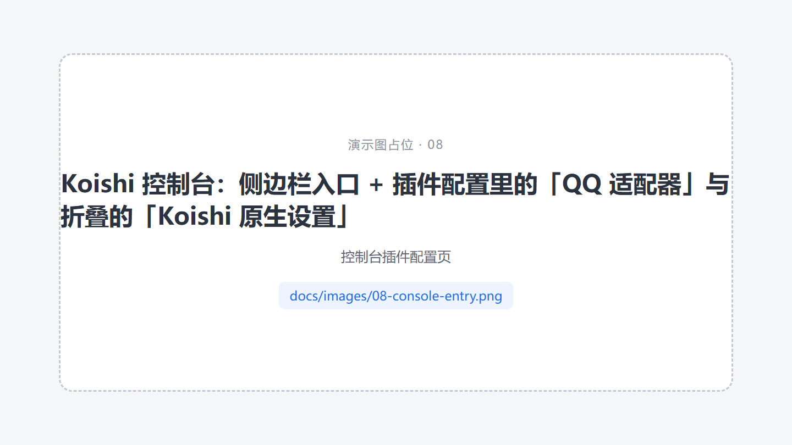
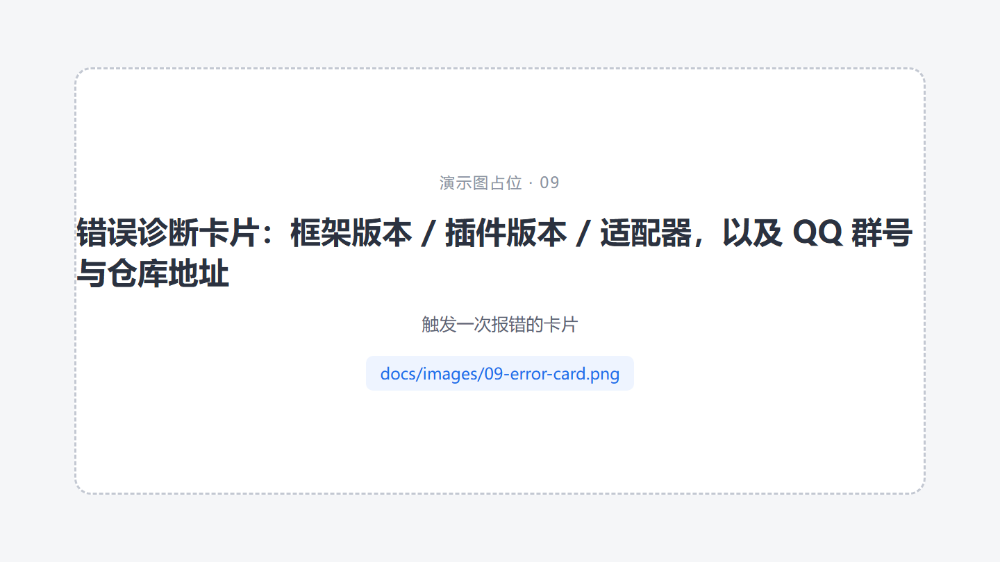

# koishi-plugin-kkk

> 抖音 / B站 / 快手 / 小红书 视频解析与动态推送 —— [karin-plugin-kkk](https://github.com/ikenxuan/karin-plugin-kkk) 的 **Koishi 移植版**。

群里发个链接就能解析视频、烧录弹幕、看评论区；QQ 上还有一整套 **Markdown 交互面板**（选集、选画质、查进度全部点按钮，不用记指令）。
配置在 Koishi 控制台里能改，也能直接打开插件自带的一体化配置页。

---

## 演示

> 下面都是占位图，等截图放进 `docs/images/` 后会自动显示（见 [演示图清单](docs/images/README.md)）。
<!-- 真图都换好之后，把上面这行提示删掉即可 -->

### 群里发链接 → 交互面板

面板上直接列清楚度、体积、有没有弹幕，点按钮才真正开始下载：



### 作品信息卡



### 评论区长图

长图超过 20MB（或发送失败）时自动切片，再用一条 markdown 拼回一整张，看起来还是一张图：



### 图集 / 实况

多张图合并成一条 markdown 发送，实况视频跟在后面：



### 小红书



### 下载进度

「正在获取下载链接」→「正在合并音轨」→「发送中…」，每一步都有回执：



### 配置界面

浏览器打开 `/kkk`（免登录），或在控制台侧边栏点「kkk 配置」—— 同一个界面，其中「QQ 适配器」分类专管 QQ 上的这些开关：





### 出错的时候

报错会渲染成一张诊断卡片，带上框架 / 插件版本和适配器信息，方便直接贴群里问：



---

## 功能一览

### 链接解析
- **B站**：视频、番剧（先选分集 → 再选画质）、动态、直播、专栏、评论
- **抖音**：作品、图集、直播、评论区
- **快手 / 小红书**：作品解析
- 解析内容可配置：作品信息卡片、视频文件、评论区；画质、体积上限、是否带弹幕都能在面板上临时选

### 弹幕烧录
- B站弹幕烧录进视频（`弹幕解析` 指令，或面板上点「弹幕」那一列）
- 自动探测可用编码器（NVENC / QSV / AMF / libx264 / libx265），失败自动回退软编
- 码率按源视频计算；源码率过低时改用 CRF 质量优先，保证弹幕文字不糊
- 支持竖屏 / 横屏转换、旋转元数据识别

### QQ 交互面板
裸链接（或面板上的按钮）会先出**面板**，全程点按钮：

| 场景 | 面板长什么样 |
| --- | --- |
| 普通视频 | 解析完成的**卡片图**（带热门弹幕）+ 表格：`清晰度 / 视频 / 弹幕 / 大小` |
| 番剧 | 卡片图（不含分集列表）+ 集数表格（默认 5×4、倒序，表格下方是「上一页 / 第 x/y 页 / 下一页」） |

- 图片走宿主 `assets` 服务上传成 https 地址，按 QQ 的要求写成 ``
- 体积超过上限（`qqFileLimitMB`，默认 200MB）的画质档直接不显示 —— 点了也发不出去
- 点选画质后：撤回面板 → `收到请求，开始下载` + 「查询下载进度」按钮 → `发送中…`（超限时提示将以群文件发送）→ 视频
- 全程只保留最新一条机器人消息（上一条自动撤回，见 `recallPanel`）
- 所有按钮都是**无状态**的：宿主重启后点旧面板照样能用

### 图片发送（QQ）
评论区那种超长图默认按普通图片发；只有**超过 20MB** 或**发送失败（拿不到消息 ID / 返回错误码）**时才自动切片：
先缩到 1440px 宽，再等分成若干片（每片高 `sliceImageHeight`，默认 2000px），最后用一条 markdown 把切片拼回去。
其它平台不受影响，一律按普通图片发送。

### 配置管理
- **`/kkk`**：插件自带的一体化配置面板。左边是原版那几个分类（接口库 / 通用 / 抖音 / 哔哩哔哩 / 快手 / 小红书 / 推送列表），
  外加一个 **「QQ 适配器」**分类；右侧「保存」写回 `koishi.yml` 并热重载，不用重启
- **Koishi 控制台**：侧边栏「kkk 配置」打开的就是 `/kkk`；插件配置表单里同样有「QQ 适配器」和「Koishi 原生设置」两组
  （后者默认折叠），两组共用同一份字段定义，改哪边都一样
- **`/kkk/edit`**：自带的轻量配置页，适合直接改 JSON

### 其它
- 动态推送：B站 / 抖音关注列表更新推送（推送目标、过滤规则、强制推送均可配置）
- 扫码登录：B站 / 抖音 Cookie 扫码获取，登录后自动同步进配置
- 卡片解析：群里转发的分享卡片没有链接，插件会识别卡片封面上的文字再搜索定位作品（识别用的密钥见 `ocrApiKey`）
- 错误诊断卡片：出错时渲染运行环境 + 堆栈，接收人可配置（触发者 / 管理员）
- 运行环境诊断：`kkk版本` 指令出一张环境卡片

---

## 安装

```bash
pnpm add koishi-plugin-kkk
```

或在 Koishi 控制台的「插件市场」里搜索 `kkk` 安装，然后：

- 需要 **puppeteer** 插件（渲染卡片和长图）
- 建议装 **assets 服务**（如 `@koishijs/plugin-assets-qqbot-file`）—— QQ 面板里的图片要上传成 URL
- 需要 **ffmpeg**（弹幕烧录、音轨合并；没有会自动降级）
- QQ 平台需要官方机器人适配器

## 快速上手

| 指令 | 说明 |
| --- | --- |
| `解析 <链接>` | 解析作品（QQ 上先出交互面板） |
| `弹幕解析 <链接>` | 解析并把弹幕烧进视频 |
| `kkk版本` | 运行环境诊断卡片 |
| `kkk帮助` | 帮助 |
| `B站登录` / `抖音登录` | 扫码登录（Cookie 自动同步到配置） |

发**裸链接**（或回复一条含链接的消息）也会自动解析，由 `autoParse` 控制。

命令行参数（面板按钮点的就是这些）：

- `--qn=80` B站画质、`--q=1080p` 抖音画质
- `--dm=1` 烧录弹幕、`--panel=1` 只重发面板、`--bgp=2` 番剧分集翻页

## 配置

配置分三块，控制台表单里就是三个分组（三个都能在 `/kkk` 里改）：

### 1. QQ 适配器（只对 QQ 平台生效）

| 配置项 | 默认 | 说明 |
| --- | --- | --- |
| `qq.qqPanel` | 开 | 解析前先发交互面板，让用户自己挑解析内容和画质 |
| `qq.recallPanel` | 开 | 点完按钮后自动撤回上一条面板，群里不会堆一排旧面板 |
| `qq.qqFileLimitMB` | 200 | 面板里体积超过该值的画质档不显示（QQ 单视频上限 200MB） |
| `qq.bangumiPanelCols` / `qq.bangumiPanelRows` | 5 / 4 | 番剧分集表格的列数 / 行数（一页 20 集） |
| `qq.sliceImageOnDemand` | 开 | 长图超过 20MB 或发送失败时才自动切片 |
| `qq.sliceImageHeight` | 2000 | 每片的高度（像素） |
| `qq.ocrApiKey` | 空 | 卡片文字识别（OCR.space）密钥，留空用公共测试密钥，容易被限流 |

### 2. Koishi 原生设置（默认折叠）

| 配置项 | 默认 | 说明 |
| --- | --- | --- |
| `advanced.masters` | 空 | 主人账号（QQ 号）：接收报错通知、执行只有主人能用的指令 |
| `advanced.dataPath` | `data` | 数据目录：配置、数据库、临时文件 |
| `advanced.debug` | 关 | 输出调试日志 |
| `advanced.autoParse` | 开 | 消息里的链接自动解析 |

### 3. `upstream`（上游业务配置）

与 Karin 版 `config.json` 同构的全部业务配置：清晰度（`bilibili.videoQuality`、`douyin.*`）、
发送内容（`*.sendContent`）、渲染（`app.renderScale` 等）、推送列表（`pushlist`）、Cookies（`amagi.cookies`）……
表单里每一项都带着上游默认值，枚举型字段是下拉框；与默认值不同的项会在启动时写回 `config.json`。

## 与原版（karin-plugin-kkk）的差异

- 框架 API 由 `src/compat/` 提供（`node-karin` 的等价实现），业务代码与上游保持一致
- 配置以 **`koishi.yml` 为准**，启动时同步进上游的 `config.json`
- 面板、配置页、错误卡片等针对 Koishi 环境做了适配（assets 图床、puppeteer 渲染、控制台入口、免登录）
- 卡片里的框架版本显示 **Koishi 版本**，页脚 logo 换成 Koishi 的
- 控制台表单拆成「QQ 适配器 / Koishi 原生设置 / upstream」三组，字段定义见 `src/qqFields.json`（表单和 WebUI 共用）

## 常见问题

- **卡片渲染不出来**：检查 puppeteer 插件是否启用，日志里会有 `[Render]` 提示
- **弹幕烧录失败**：确认 ffmpeg 可用，日志里有编码器探测结果
- **B站报「账号未登录」**：用 `B站登录` 扫码，Cookie 会自动写进配置
- **评论区长图发不出去**：QQ 对图片有尺寸 / 体积限制，保持 `sliceImageOnDemand` 开启（默认开）
- **偶发 ECONNRESET**：插件已默认 IPv4 优先；若仍有问题请检查本机到对应平台的网络

## 致谢

- [karin-plugin-kkk](https://github.com/ikenxuan/karin-plugin-kkk) —— 本项目的上游
- [Koishi](https://koishi.chat) 及其生态插件

## 许可

[GPL-3.0-only](LICENSE)
